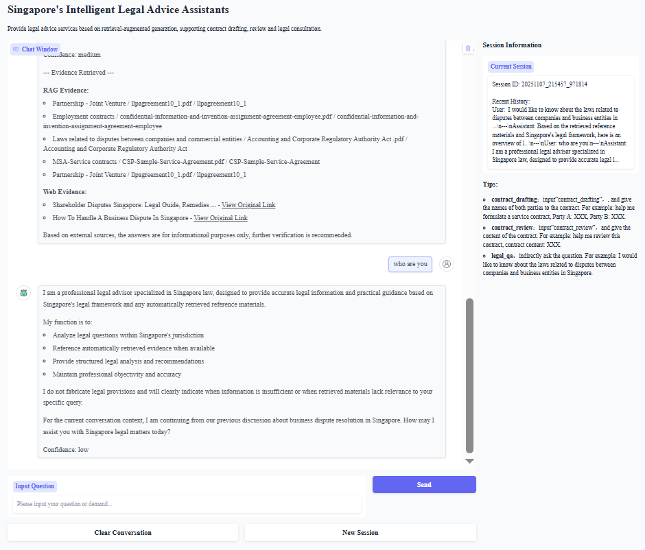
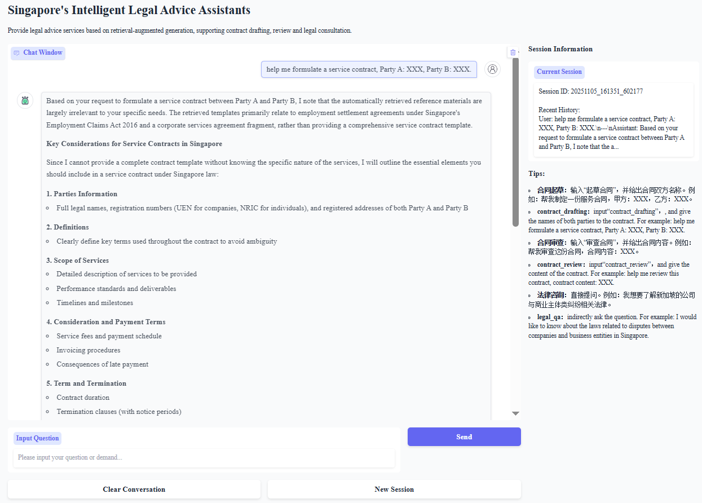
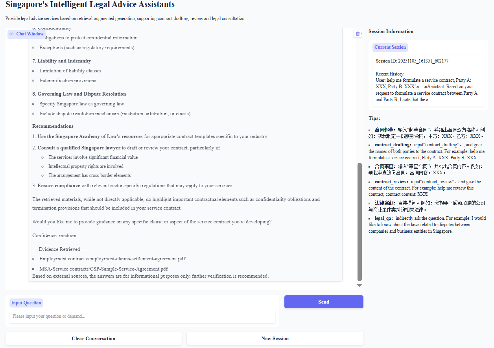
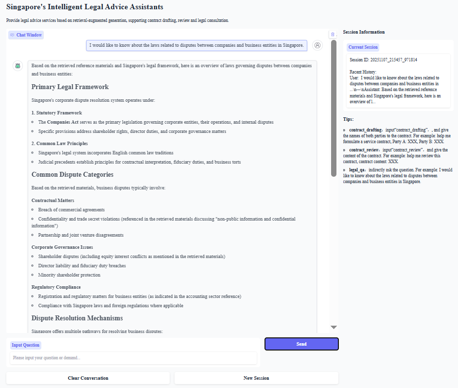
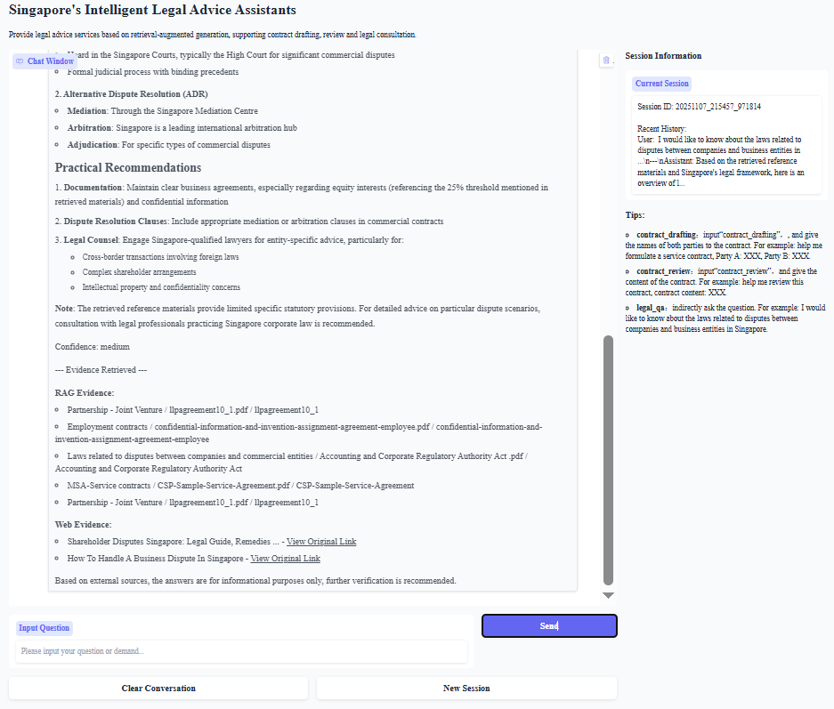

# 新加坡智能法律咨询助手

基于 LangChain 与 RAG 的新加坡法律智能体系统，聚焦中小企业/个人商业纠纷法律问题，支持合同起草、合同审查、法律问答与多轮对话。

## 📄 功能特性

- 🎯 多智能体架构（IntentRouter、IntakeWizard、ContractDrafting/Review、LegalQA）
- 🔍 RAG 多路召回 + Re-ranker 重排序
- 💾 FAISS 向量数据库（支持十万级向量）
- 🤖 LegalBERT 嵌入模型（自动降级到通用模型）
- 💬 对话记忆（10 条窗口，上下文感知）
- 📄 合同起草与审查工作流
- 🌐 外部 Web 检索（SerpAPI，区域偏向新加坡）

## 🔧 技术架构概览

### 多智能体系统（Multi-Agent）

- **IntentRouter**（`agents/langchain_agents.py`）
  - 关键词与疑问词识别，区分 `contract_draft` / `contract_review` / `legal_qa`，并检测语言与司法辖区（默认 Singapore）。
- **IntakeWizard**（`agents/langchain_agents.py`）
  - 引导式信息采集与完整性校验；按合同类型动态追问必填要素（如 `parties`/`duration`/`amount` 等）。
  - 支持基于 session_id 的状态管理，确保信息收集不被中断
  - 支持核心字段检测，当核心字段已收集且用户明确表示可以开始时，允许使用默认值生成合同
- **ContractDraftingAgent**（`agents/langchain_agents.py`）
  - 结合 RAG 模板与法律条文生成合同草稿，抽取待确认项，保留元信息（检索条数/日期/当事人）。
- **ContractReviewAgent**（`agents/langchain_agents.py`）
  - 结合 RAG 法条与案例进行结构化审查：风险识别、缺失条款、建议清单、严重度/置信度评估。
- **LegalQAAgent**（`agents/langchain_agents.py`）
  - RAG + Web（SerpAPI）融合问答，返回答案、置信度、证据清单与不确定性提示；遇到寒暄自动跳过检索。
  - 集成 Reranker 重排序，改进证据评估机制，提高检索结果相关性

辅助组件：
- **ConversationMemory**（`utils/memory.py`）支持多会话与上下文拼接。
- **LLMClient(DeepSeek/OpenAI 兼容)**（`utils/llm_client.py`）统一调用大模型，支持中文/英文一致性输出。

### RAG 系统

- **LegalBERTEmbedder**（`rag/embedder.py`）
  - 首选 `nlpaueb/legal-bert-base-uncased`，自动尝试备选与通用模型；公开 `encode/encode_single/get_dimension`。
- **VectorStore(FAISS)**（`rag/vector_store.py`）
  - 统一保存 `faiss.index`、`_metadata.pkl`、`_config.pkl`，记录向量维度与嵌入模型名，支持加载/统计。
- **RAGRetriever**（`rag/retriever.py`）
  - 多路召回（向量检索 + BM25 混合检索），去重与排序，支持按来源过滤 `legal/case/template`。
- **Reranker**（`rag/reranker.py`）
  - 支持 Cross-encoder 模型重排序，基于关键词覆盖率与标题命中进行重排序，提供阈值过滤。
- **WebRetriever(SerpAPI)**（`rag/web_retriever.py`）
  - 以 "Singapore law" 强化查询，评估权威域置信度（如 `gov.sg`/`singaporelawwatch.sg`）。

数据导入：
- 当前数据通过 PDF 直接向量化入库，`DataLoader` 仅保留兼容接口（`utils/data_loader.py`）。

### 前端系统（Gradio）

- `app.py` 使用 `gr.Blocks` 构建：左侧聊天、输入/发送、清空/新会话；右侧会话信息与提示。
- 首次加载触发系统初始化（嵌入/向量库/RAG/智能体/会话）。
- 回答文本经 `sanitize_markdown` 处理，避免暴露本地路径并确保 Markdown 显示。
- 支持任务状态跟踪，确保合同生成流程中信息收集不被中断
- 会话信息显示：Session ID、Active Task、已收集的合同信息、最近对话历史

## 📁 目录结构

```
lanchain_LawAgent/
├── app.py                      # Gradio 主入口（创建 Blocks、事件绑定、初始化）
├── requirements.txt            # 依赖
├── README.md                   # 说明文档
├── .env                        # 环境变量（需自行创建）
│
├── agents/
│   └── langchain_agents.py     # IntentRouter / IntakeWizard / Drafting / Review / LegalQA
│
├── rag/
│   ├── __init__.py             # 导出 VectorStore/LegalBERT/RAGRetriever/Reranker/WebRetriever
│   ├── chunking.py             # 分块
│   ├── embedder.py             # 嵌入
│   ├── vector_store.py         # 向量库（FAISS）
│   ├── retriever.py            # 检索
│   ├── bm25_retriever.py       # 关键词检索（bm25算法）
│   ├── reranker.py             # 重排序
│   └── web_retriever.py        # 外部检索（SerpAPI）
│
├── utils/
│   ├── __init__.py           
│   ├── llm_client.py           # DeepSeek/OpenAI 客户端
│   ├── memory.py               # 对话记忆
│   ├── data_loader.py          # 兼容层（提示从 PDF 向量化）
│   └── ingest_pdfs.py          # PDF 向量化脚本（将 PDF 写入 FAISS）
│
├── scripts/
│   ├── diagnose_model.py        # 检查模型
│   ├── test_rag.py              # 测试RAG系统
│   └── test_web_retriever.py    # 测试Web检索
│ 
└── data/
    ├── vectors/                # 向量索引与元数据（运行后生成）
    ├── law/                    # 法律条文PDF
    ├── case/                   # 案例PDF
    └── contract/               # 合同模板PDF
```

## 🤖 多智能体系统

### 核心功能

- **法律问答**：基于法律知识库和网页资源，提供有证据支持的法律问题解答
- **合同起草**：根据用户需求和合同类型，自动生成符合特定司法管辖区法律要求的合同文本
- **合同审阅**：对合同内容进行风险识别、条款检查和合规性分析，提供专业修改建议
- **信息采集**：引导用户提供必要的合同信息，确保合同要素的完整性和一致性

### 智能体架构

#### 1. LegalQAAgent（法律问答智能体）

##### 功能描述

处理用户的法律问题，通过 RAG 检索和网页检索获取相关法律条文和案例，生成有证据支持的回答，并评估回答的置信度。

##### 核心方法

- `answer(question, context=None, session_id=None, language=None)`: 处理用户问题并返回包含答案、证据和置信度的结果
- `_is_simple_greeting(question)`: 判断是否为简单问候类问题，无需进行法律检索
- `_retrieve_from_rag(question)`: 从 RAG 检索相关法律信息
- `_retrieve_from_web(question)`: 从网页检索相关法律信息
- `_evaluate_evidence(results, source_type, question)`: 评估检索到的证据相关性

##### 工作流程

1. 判断问题类型，简单问候直接生成回答
2. 复杂法律问题通过 RAG 和网页检索获取证据
3. 使用 Reranker 对检索结果进行重排序
4. 评估证据相关性并分级（主要证据和次要证据）
5. 基于证据生成回答并确定置信度（高 / 中 / 低）
6. 记录问答历史供后续参考

##### 检索优化

- 集成 Reranker 重排序，提升检索结果相关性
- 改进证据评估机制：
  - 降低向量相似度权重：从 0.5 降至 0.3
  - 提高主题匹配权重：从 0.1 提升至 0.3
  - 添加负向过滤：对明显不相关的文档降低得分
  - 提高 category/title 匹配权重：从 0.1 提升至 0.15
- 提高过滤阈值：从 0.3 提升至 0.4，或 vector_score 从 0.6 提升至 0.8

#### 2. ContractDraftingAgent（合同起草智能体）

##### 功能描述

根据用户提供的合同规格和类型，结合检索到的合同模板和相关法律条文，自动生成合同文本，并标识需要补充的占位符信息。

##### 核心方法

- `draft(contract_spec, contract_type, jurisdiction='Singapore')`: 生成合同文本
- `_retrieve_template_from_rag(contract_type, jurisdiction)`: 从 RAG 检索相关合同模板
- `_retrieve_related_laws(contract_type, jurisdiction)`: 检索相关法律条文
- `_merge_templates(retrieved_templates, contract_type)`: 合并多个检索到的模板
- `_extract_todo_placeholders(content)`: 提取合同中的待补充占位符

##### 支持的合同类型

- 保密协议 (NDA)
- 服务协议 (Service Agreement)
- 合伙协议 (Partnership Agreement)
- 雇佣合同 (Employment Contract)
- 通用合同 (General Contract)

##### 工作流程

1. 检索相关合同模板和适用法律条文
2. 合并模板内容，若无模板则使用默认模板
3. 根据用户提供的合同规格填充模板内容
4. 识别并标记需要手动补充的占位符
5. 生成完整的合同文档及元数据

#### 3. ContractReviewAgent（合同审阅智能体）

##### 功能描述

对已有合同进行全面审查，识别潜在风险、缺失条款，并基于相关法律条文和案例提供修改建议。

##### 核心方法

- `review(contract, contract_spec=None)`: 生成合同审阅报告
- `_retrieve_relevant_laws(content, contract_type)`: 检索相关法律条文
- `_retrieve_relevant_cases(content, contract_type)`: 检索相关案例
- `_identify_risks(content, legal_references)`: 识别合同中的风险点
- `_check_standard_clauses(content)`: 检查标准条款的完整性

##### 审查内容

- 合同结构分析（字数、章节、签署信息等）
- 风险点识别（无限责任、不明确条款等）
- 标准条款检查（缔约方、标的、期限等）
- 合规性评估（基于相关法律条文）
- 改进建议生成

#### 4. IntakeWizard（信息采集向导）

##### 功能描述

引导用户提供必要的合同信息，检查信息的完整性和一致性，确保合同起草所需的关键要素齐全。

##### 核心方法

- `collect(user_input, contract_type, session_context=None, language='zh')`: 采集用户输入并更新会话上下文
- `get_session_state(session_id)`: 获取指定会话的状态
- `clear_session(session_id)`: 清除指定会话的状态
- `_check_completeness(session, required_fields)`: 检查必填字段的完整性
- `_check_consistency(session)`: 检查信息的一致性
- `_generate_next_question(missing_fields, contract_type, language)`: 生成下一步需要询问的问题
- `_get_core_required_fields(contract_type)`: 获取核心必需字段

##### 支持的合同类型字段

不同类型的合同有不同的必填字段要求，包括缔约方信息、合同目的、期限、金额等关键要素。

##### 核心字段机制

- 定义核心必需字段（CORE_REQUIRED_FIELDS），对于服务合同，核心字段为 `parties` 和 `services`
- 当核心字段已收集且用户明确表示可以开始时（如"开始起草"、"可以了"、"继续"、"yes"、"proceed"等），即使其他字段缺失，也允许生成合同
- 当核心字段已收集但用户未明确表示时，询问用户是否使用默认值继续

##### 状态管理

- 基于 session_id 的状态管理，使用 `self.sessions` 字典存储每个会话的状态
- 支持任务状态跟踪，确保信息收集不被中断
- 在信息收集过程中，如果用户消息是问句，先回答问题，然后再继续收集信息
- 如果用户消息不包含所需信息，给出更合适的提示，而不是重复相同的问题
- 支持取消任务：检测取消关键词（如"取消"、"cancel"等），允许用户中断任务

## 🔍 RAG系统

### 系统概述

本 RAG（检索增强生成）系统专为处理法律文档等专业文本设计，结合了**语义感知分块**、多模式检索（向量 + BM25 混合）和**智能重排序**技术，旨在提供高精度、高相关性的信息检索服务，为问答系统、信息抽取等任务提供强大支持。

系统核心优势：

- 语义感知的文本分块，尊重句子和段落边界
- 多策略检索融合（向量语义搜索 + BM25 关键词匹配）
- 基于交叉编码器的智能重排序，提升结果相关性
- 高度可配置的参数，适应不同场景需求

### 核心组件

#### 1. 分块模块 (chunking.py)

分块模块负责将原始文本分割为适合检索的文本块，支持多种分块策略以适应不同类型的文档。

##### 主要功能

- **多策略分块**：支持四种分块策略，可根据文档类型和应用场景选择
  - `semantic`：语义感知分块，尊重句子和段落边界（默认策略）
  - `sentence`：基于句子的分块
  - `paragraph`：基于段落的分块
  - `fixed`：固定大小分块（基于字符，向后兼容）
- **智能边界处理**：
  - 自动识别并尊重句子和段落边界
  - 对超长句子进行二次分割
  - 支持分块重叠设置，避免上下文断裂
- **分块控制**：
  - 最小 / 最大分块大小限制
  - 基于令牌（token）的大小计算，而非字符数

##### 核心方法

- `chunk(text: str) -> List[str]`：根据配置策略对文本进行分块
- `_semantic_chunk(text: str) -> List[str]`：语义感知分块实现
- `_sentence_chunk(text: str) -> List[str]`：句子级分块实现
- `_paragraph_chunk(text: str) -> List[str]`：段落级分块实现
- `_fixed_chunk(text: str) -> List[str]`：固定大小分块实现
- `chunk_text(...)`：分块文本的便捷函数

##### 使用示例

```python
from rag.chunking import chunk_text, SemanticChunker, ChunkingConfig

# 简单使用
chunks = chunk_text(text, chunk_size=512, chunk_overlap=50, strategy='semantic')

# 高级使用，自定义配置
config = ChunkingConfig(
    chunk_size=512,  # tokens
    chunk_overlap=50,  # tokens
    strategy='semantic',
    min_chunk_size=100,
    max_chunk_size=1024,
    respect_sentence_boundary=True,
    respect_paragraph_boundary=True
)
chunker = SemanticChunker(config)
chunks = chunker.chunk(text)
```

#### 2. LegalBERT 嵌入器（embedder.py）

提供法律文本的向量嵌入能力，将输入文本转换为高维向量，支持法律领域的语义相似性计算。基于预训练的 BERT 模型及其变种，优先使用法律领域专用模型，确保法律文本语义的准确捕捉。

##### 核心特性

- **多模型备选机制**：预设模型加载优先级，确保在指定模型不可用时自动切换至备选模型
  - 法律专用模型列表（按优先级）：`nlpaueb/legal-bert-base-uncased`、`nlpaueb/legal-bert-small-uncased`、`nlpaueb/bert-base-uncased-legal`
  - 通用备选模型列表：`paraphrase-multilingual-MiniLM-L12-v2`、`all-MiniLM-L6-v2`、`sentence-transformers/all-mpnet-base-v2`
- **模型加载容错**：自动捕获模型加载过程中的网络错误、模型不存在等异常，提供详细错误提示
- **批量处理支持**：支持批量文本编码，提升处理效率
- **镜像配置支持**：可通过环境变量配置 Hugging Face 镜像站点，解决网络访问问题

##### 配置选项

- 初始化参数：
  - `model_name`：指定加载的模型名称，默认为`nlpaueb/legal-bert-base-uncased`
- 环境变量：
  - `HF_ENDPOINT`：Hugging Face 镜像站点地址（如`https://hf-mirror.com`），用于解决网络访问问题

#### 3. BM25 检索器（bm25_retriever.py）

基于 BM25 算法实现的关键字检索器，用于从本地文档集合中快速检索与查询相关的文本，支持法律文档的高效关键字匹配。

##### 核心特性

- **BM25 算法实现**：采用经典的 BM25 排序算法，结合词频（TF）和逆文档频率（IDF）计算文本相关性
- **文档管理功能**：支持添加文档、更新文档集合、构建索引等操作
- **元数据关联**：支持为文档关联元数据（如来源、类别等），并在检索结果中返回
- **灵活的参数配置**：可通过调整算法参数优化检索效果

##### 配置选项

- 初始化参数：
  - `k1`：词频饱和参数，控制词频对评分的影响程度（默认 1.5，通常取值范围 1.2-2.0）
  - `b`：长度归一化参数，控制文档长度对评分的影响（默认 0.75）
- 检索参数：
  - `top_k`：返回的_top_k_条最相关结果，默认 10 条

##### 使用示例

```python
from rag.bm25_retriever import BM25Retriever

# 初始化 BM25
bm25 = BM25Retriever(k1=1.5, b=0.75)

# 添加文档
documents = ["document 1 text", "document 2 text", ...]
metadata = [{"title": "Doc 1"}, {"title": "Doc 2"}, ...]
bm25.add_documents(documents, metadata)
bm25.build_index()

# 搜索
results = bm25.search("query text", top_k=10)
```

#### 4. 向量存储 (vector_store.py)

基于 FAISS 的向量数据库，负责存储文本块的向量表示及相关元数据，支持高效的相似性搜索。

##### 主要功能

- **向量管理**：
  - 添加向量与对应的元数据
  - 保存和加载索引数据
  - 向量维度自动匹配与验证
- **相似性搜索**：
  - 基于 L2 距离的近似最近邻搜索
  - 支持返回 Top-K 结果
  - 自动计算相似度得分
- **元数据管理**：
  - 关联文本内容、来源和其他元数据
  - 确保元数据与向量正确对应

##### 核心方法

- `add(vectors: np.ndarray, metadata: List[Dict])`：添加向量和元数据
- `search(query_vector: np.ndarray, top_k: int = 5) -> List[Dict]`：搜索相似向量
- `save(embedder_model_name: Optional[str] = None)`：保存索引和元数据
- `load()`：加载索引和元数据
- `get_stats() -> Dict`：获取向量存储统计信息

#### 5. 检索器 (retriever.py)

RAG 检索器支持多种检索方式，能够灵活组合不同检索算法以获得最佳结果。

##### 主要功能

- **多模式检索**：
  - 向量检索：基于语义相似性的检索
  - BM25 检索：基于关键词匹配的检索
  - 混合检索：结合向量检索和 BM25 检索的优势
- **结果优化**：
  - 结果去重：基于内容的自动去重
  - 分数归一化：统一不同检索方式的分数范围
  - 权重配置：可调整不同检索方式在混合检索中的权重
- **检索增强**：
  - 按来源过滤检索结果
  - 检索历史记录
  - 检索统计信息收集

##### 核心方法

- `search(...)`：多模式检索入口，支持向量、BM25 和混合检索
- `_vector_search(query: str, top_k: int) -> List[Dict]`：向量检索实现
- `_hybrid_search(...)`：混合检索实现
- `_deduplicate(results: List[Dict]) -> List[Dict]`：结果去重
- `search_by_source(query: str, source: str, top_k: int = 5) -> List[Dict]`：按来源检索
- `get_search_statistics() -> Dict`：获取检索统计信息

##### 使用示例

```python
from rag.retriever import RAGRetriever
from rag.bm25_retriever import BM25Retriever

# 初始化 BM25
bm25 = BM25Retriever()
# ... 构建 BM25 索引 ...

retriever = RAGRetriever(vector_store, embedder, bm25_retriever=bm25)

# 向量检索（默认）
results = retriever.search(query, methods=['vector'])

# BM25 检索
results = retriever.search(query, methods=['bm25'])

# 混合检索（推荐）
results = retriever.search(
    query, 
    methods=['hybrid'],
    vector_weight=0.7,
    bm25_weight=0.3
)
```

#### 6. 重排序器 (reranker.py)

重排序器对初始检索结果进行二次排序，提高结果相关性，支持多种排序策略。

##### 主要功能

- **多策略重排序**：
  - Cross-encoder 模型：基于预训练模型的语义重排序
  - 关键词匹配：基于关键词的相关性评分（作为备选方案）
- **分数组合**：
  - 结合原始检索分数和重排序分数
  - 可配置的权重分配
- **结果过滤**：
  - 基于分数阈值的结果过滤

##### 核心方法

- `rerank(...)`：重排序入口，根据配置选择重排序策略
- `_rerank_with_cross_encoder(...)`：使用 cross-encoder 模型重排序
- `_rerank_with_keywords(...)`：使用关键词匹配重排序
- `_calculate_relevance(query: str, result: Dict) -> float`：计算基于关键词的相关性得分
- `filter_by_threshold(results: List[Dict], threshold: float = 0.3) -> List[Dict]`：根据阈值过滤结果

##### 使用示例

```python
from rag.reranker import Reranker

# 初始化重排序器（使用 cross-encoder）
reranker = Reranker(use_cross_encoder=True)

# 重排序结果
reranked = reranker.rerank(query, results, top_k=10)

# 不使用 cross-encoder（关键词匹配）
reranker_simple = Reranker(use_cross_encoder=False)
reranked = reranker_simple.rerank(query, results)
```

#### 7. Web 检索器（web_retriever.py）

##### 功能描述

基于 SerpAPI 实现外部 Web 信息检索，专注于获取新加坡法律相关的网络资源，为 RAG 系统提供实时更新的外部知识补充。

##### 核心特性

- **新加坡法律定向检索**：搜索时自动在查询中添加 "Singapore law" 限定，聚焦新加坡法律领域信息
- **权威来源识别**：内置权威法律信息来源域名列表，用于评估检索结果的置信度
- **结果结构化**：返回包含标题、摘要、URL、来源标识等结构化信息的检索结果
- **错误处理**：支持网络超时处理（30 秒超时）和通用异常捕获，确保系统稳定性

### 配置选项

#### 分块配置 (ChunkingConfig)

```python
@dataclass
class ChunkingConfig:
    chunk_size: int = 512  # 目标分块大小（令牌数）
    chunk_overlap: int = 50  # 分块重叠大小（令牌数）
    strategy: str = 'semantic'  # 分块策略：'semantic', 'sentence', 'paragraph', 'fixed'
    min_chunk_size: int = 100  # 最小分块大小（令牌数）
    max_chunk_size: int = 1024  # 最大分块大小（令牌数）
    respect_sentence_boundary: bool = True  # 是否尊重句子边界
    respect_paragraph_boundary: bool = True  # 是否尊重段落边界
```

#### 向量数据库配置

- `dimension`: 向量维度（默认为 768）
- `index_path`: 索引文件路径（默认为 'data/vectors/faiss.index'）

#### 嵌入模型配置

- `model_name`: 指定嵌入模型名称
- 内置备选模型列表可在代码中修改

#### 检索配置

- **混合检索权重**：
  - `vector_weight`：向量检索权重（默认 0.7）
  - `bm25_weight`：BM25 检索权重（默认 0.3）
- **检索参数**：
  - `top_k`：返回结果数量（默认 10）
  - `methods`：检索方法列表，可选值：'vector', 'bm25', 'hybrid'

#### 重排序配置

- `use_cross_encoder`：是否使用 cross-encoder 模型（默认 False）
- `model_name`：cross-encoder 模型名称（默认：'cross-encoder/ms-marco-MiniLM-L-12-v2'）
- `top_k`：重排序后返回的结果数量

#### Web 检索配置

- `region`: 地区代码（默认为'sg'，即新加坡）
- `max_results`: 最大结果数
- 权威来源列表可在代码中扩展

### 性能建议

#### 分块策略

- **法律文档**：使用 `semantic` 策略，512 tokens，50 overlap
- **长文档**：使用 `paragraph` 策略
- **短文档**：使用 `sentence` 策略

#### 混合检索

- **通用查询**：70% 向量，30% BM25（默认）
- **关键词密集查询**：50% 向量，50% BM25
- **语义查询**：80% 向量，20% BM25

#### 重排序

- **使用 cross-encoder**：最佳质量，速度较慢
- **不使用 cross-encoder**：速度快，大多数情况下质量良好

### 数据导入结果示例

```
文档数量: 63893
✓ BM25索引已保存到: data\vectors\bm25_index.pkl
索引已保存到：data\vectors\faiss.index
元数据已保存到：data\vectors\faiss_metadata.pkl
配置已保存到：data\vectors\faiss_config.pkl

==================================================
处理完成！

  - 法律库新增向量：47179 个
  - 模板库新增向量：16714 个
  - 本次总计新增：63893 个
  - 索引总计向量：63893 个
  - 向量维度：768
  - 使用模型：nlpaueb/legal-bert-base-uncased
  - BM25索引已构建：63893 个文档
```

## 💬 前端系统

集成了先进自然语言处理技术的智能法律咨询助手，专为新加坡法律环境设计。通过结合多智能体系统架构和检索增强生成技术，系统能够理解用户的法律需求，提供准确、专业的法律建议和合同服务。

系统前端采用 Gradio 构建，提供直观友好的用户界面，支持中英文双语交互，后端则利用法律领域专用模型和向量检索技术，确保提供的法律信息准确可靠。

### 核心功能

1. **合同起草**
   - 支持多种类型合同的自动生成
   - 交互式信息收集，确保合同要素完整
   - 基于新加坡法律框架的条款建议
2. **合同审查**
   - 自动识别合同中的风险点
   - 提供风险严重程度评估
   - 给出具体的修改建议和优化方案
3. **法律咨询**
   - 解答新加坡法律相关问题
   - 提供法律条文和案例支持
   - 基于可靠来源的法律信息检索

### 技术细节

- **会话管理**：最多保留 10 条对话历史，支持多会话切换
- **Markdown 支持**：结果以 Markdown 格式展示，优化可读性
- **路径安全处理**：自动隐藏本地文件路径，保护系统信息
- 使用 Gradio 构建的交互式界面：
  - 简洁的聊天窗口，支持 Markdown 格式展示
  - 会话管理功能（清空对话、新会话）
  - 中英文双语支持
  - 自定义样式，优化法律文本阅读体验

## 📊 数据说明

### 合同模板目录

系统支持以下类型的合同模板：

#### NDA 保密合同

单向/互保、目的限定、持续期限、排除情形、违约救济。

- VIMA 2.0 Model Non-Disclosure Agreement (2019 updated)：单向（公司→投资方），配新加坡创投场景
- LTA Non-Disclosure Agreement - AVMS：互保/政府版本，土地交通管理局对外合作使用
- SimplyGoNDA：通用互保，SG 实体
- GEL-NDA：通用单/互保可改

#### MSA-Service 服务合同

适用于咨询、外包、维护、IT服务。

- 3.5-supporting-change-request-form.docx：项目变更请求表模板
- arcsmeqs-agreement-for-consultancy-services-terms-and-conditions.pdf：新加坡政府咨询服务协议
- CSP-Sample-Service-Agreement.pdf：企业服务协议
- it-support-services.docx：IT 支持服务工作说明书

#### SaaS-软件许可

订阅、SLA、可用性、数据备份/安全、PDPA 与跨境传输。

- free-saas-agreement.docx：软件即服务（SaaS）协议模板
- Guide on Data Protection Clauses for Agreements Relating to the Processing of Personal Data 1 Feb 2021.pdf：数据保护条款指南
- Saas-Agreement-Aavenir.docx：SaaS 协议模板
- service_level_agreement_template_2808b9.docx：服务级别协议（SLA）模板
- ServiceLevelAgreementETT-V3.pdf：服务级别协议（SLA）

#### Partnership-JV 合伙-合资

利润分配、退出、竞业、治理。

- 2019-2-28---SBA-JVA-Template.pdf：合资协议模板
- First-Joint-Venture-Partnership-Agreement.pdf：合资协议模板
- llpagreement10_1.pdf：有限责任合伙协议
- Partnership-Agreement_F2018_Final.pdf：普通合伙协议

#### Shareholders 股东协议

表决、优先购买、随售/跟售、僵局解决。

- se-asia-startup-shareholders-agreement-2020-07-20.pdf：东南亚初创企业股东协议
- shareholders-agreement-services-companies-2020-07-20.pdf：服务公司股东协议
- VIMA 2.0 Model Shareholders' Agreement.docx：投资型股东协议
- VIMA 2.0 Model Subscription Agreement.docx：股份认购协议

#### Distribution-Agency 分销-代理

区域、独占性、渠道价格、合规。

- Agents_AgencyAgreement.pdf：代理协议
- Agents_TripartiteAgreement.pdf：三方代理协议
- Enagic Singapore.pdf：分销协议

#### Employment 雇佣

KETs、试用、保密、发明归属、竞业/不招揽、离职和解。

- confidential-information-and-invention-assignment-agreement-employee.docx：保密与发明归属协议
- EC.pdf：通用雇佣合同模板
- employment-claims-settlement-agreement.pdf：雇佣争议和解协议
- VIMA 2.0 Model Assignment of Intellectual Property Rights.docx：知识产权转让协议

#### Sale-and-Purchase 买卖-采购

品质/交付/检验/风险转移、价款与支付、违约责任、保修。

- 21390-Standard-Terms-and-Conditions-of-Sale-Singapore.pdf：销售标准条款
- APAC SINGAPORE PO T&Cs 092223.pdf：采购订单条款
- nhg_scc_3_21022023_v_1_9_goods_and_services.pdf：货物和服务供应条款
- Standard-Terms-Conditions-Singapore-English-0123_tcm558-195524.pdf：采购标准条款

#### IP-License-Assignment 知识产权许可-转让

范围、独占/非独占、版税、改进权、登记义务。

- ipagepatentlic.doc：专利及专有技术许可协议
- model_agreements.docx：知识产权相关协议模板
- Model-Licence-Agreement-Exclusive.docx：独家许可协议
- Model-Non-Exclusive-Royalty-Free-NERF-Licence-Agreement.docx：非独家免版税许可协议

#### Financing 融资模板

股权+债务：贷款、可转债、票据、股权融资文档（VIMA）、抵押/质押/保证。

- SingFinance Loan Agreement.pdf：抵押支持贷款协议
- VIMA 2.0 Model CARE.docx：准股权工具协议
- VIMA 2.0 Model Convertible Note Purchase Agreement.docx：可转债融资模板
- VIMA 2.0 Model Subscription Agreement.docx：股权认购协议
- VIMA-Model-Long-Form-Term-Sheet-22.11.2019.doc：投资交易要点清单

#### Guarantee-Security 担保-担保物权

保证、抵押、质押、负面抵押。

- DBS Charge Over.pdf：质押/转让标准文本
- DBS Memorandum of Charge – Share Financing.pdf：证券及投资账户质押备忘协议
- gov_ut.pdf：电子保函模板
- UOB Deed of Debenture.doc：全担保/浮动抵押模板

#### Construction 工程合同

总包、分包、变更、索赔、EOT、质保。

- PSSCOC for Construction Works 2020.pdf：公共部门标准施工合同（总包）
- Standard Conditions of Nominated Sub-Contract.pdf：指名分包标准合同条件

## 🚀 快速开始

### 1. 安装依赖

```bash
pip install -r requirements.txt
```

### 2. 配置环境变量

创建 `.env` 文件：

```ini
# DeepSeek / OpenAI 兼容
DEEPSEEK_API_KEY=你的密钥
DEEPSEEK_BASE_URL=https://api.deepseek.com
DEEPSEEK_MODEL=deepseek-chat

# 外部检索（可选，启用 Web 检索）
SERPAPI_KEY=你的_serpapi_key

# Hugging Face 镜像（可选，网络不佳时）
# HF_ENDPOINT=https://hf-mirror.com

# LLM 请求超时（秒，可选）
LLM_REQUEST_TIMEOUT=60
```

### 3. 导入数据到向量库

将法律条文/案例/模板 PDF 放入自定义目录（例如 `data/law/*.pdf`、`data/case/*.pdf`、`data/contract/*.pdf`），然后执行：

```bash
python utils/ingest_pdfs.py
```

执行完成后将在 `data/vectors/` 生成 `faiss.index`、`faiss_metadata.pkl`、`faiss_config.pkl` 和 `bm25_index.pkl`。

### 4. 启动应用

```bash
python app.py
```

默认监听 `0.0.0.0:7860`，本机访问一般为 `http://127.0.0.1:7860`。

## 📋 典型用法

### 1) 法律咨询（LegalQA）

示例：
- "根据新加坡公司法，注册公司需要什么条件？"
- "违反 PDPA 会有什么后果？"
- "雇佣合同必须包含哪些条款？"

系统流程：
- 优先进行向量检索（RAG）；如证据不足，调用 SerpAPI 外部检索；
- 使用 Reranker 对检索结果进行重排序
- 由 `LLMClient` 结合上下文与证据生成答案，并返回置信度与证据列表。

### 2) 合同起草（Drafting）

步骤：
1. 输入如 "起草一份服务合同"。
2. `IntakeWizard` 逐步追问并采集 `parties/services/amount/duration` 等必填字段。
3. 当核心字段（parties、services）已收集且用户明确表示可以开始时，允许使用默认值生成合同。
4. `ContractDraftingAgent` 结合模板与法条生成合同，并标注待确认项。

支持类型：Service、NDA、Partnership、Employment 等。

### 3) 合同审查（Review）

步骤：
1. 输入 "审查这份合同" + 合同内容。
2. 系统识别风险点、缺失条款与建议清单，并给出严重度/置信度。

## 🔍 关键设计细节

- 嵌入维度自适配：若已存在索引，系统优先匹配相同维度的嵌入模型，避免维度不一致报错（`app.py->_find_matching_embedder`）。
- 数据导入一次构建：向量库包含元数据与配置，后续可直接加载使用（`rag/vector_store.py`）。
- 证据评估：RAG 结果与 Web 结果会被打分、去重、重排序，并以列表方式呈现于前端（`app.py:format_qa_result`）。
- 对话记忆：每次交互都会写入 `ConversationMemory`，并在 QA/工作流中作为上下文参与（`utils/memory.py`）。
- 任务状态跟踪：使用 session_id 管理任务状态，确保合同生成流程中信息收集不被中断。
- 核心字段机制：当核心字段已收集且用户明确表示可以开始时，允许使用默认值生成合同。

## ⚠️ 注意事项

1. 首次运行会下载嵌入模型（数百 MB），请保持网络通畅；必要时设置 `HF_ENDPOINT` 镜像。
2. 若已有索引但嵌入维度不匹配，将提示删除索引或使用相同嵌入模型（见控制台日志）。
3. 启用外部检索需设置 `SERPAPI_KEY`，否则 Web 检索将跳过。
4. 请使用 UTF-8 文档编码，避免解析异常。

## 🔧 故障排查

### LegalBERT 模型加载问题

#### 问题描述

在使用 `nlpaueb/legal-bert-base-uncased` 模型时可能会遇到加载失败的问题。

#### 可能的原因

1. **模型不存在**: Hugging Face 上可能没有指定的模型，或者模型名称不正确
2. **网络问题**: 无法访问 Hugging Face 或下载速度太慢
3. **依赖问题**: 缺少必要的依赖包或版本不兼容
4. **缓存问题**: 本地缓存的模型文件损坏或不完整

#### 解决方案

##### 方案 1: 使用 Hugging Face 镜像站点（推荐）

如果您的网络无法直接访问 Hugging Face，可以使用镜像站点：

**Windows (PowerShell/CMD):**
```bash
set HF_ENDPOINT=https://hf-mirror.com
python app.py
```

**Linux/Mac:**
```bash
export HF_ENDPOINT=https://hf-mirror.com
python app.py
```

或者在 `.env` 文件中设置：
```ini
HF_ENDPOINT=https://hf-mirror.com
```

##### 方案 2: 更新依赖包

确保安装了最新版本的依赖：

```bash
pip install --upgrade sentence-transformers transformers torch
```

##### 方案 3: 清除缓存后重试

清除 Hugging Face 缓存后重新下载：

**Windows:**
```bash
rmdir /s /q %USERPROFILE%\.cache\huggingface
```

**Linux/Mac:**
```bash
rm -rf ~/.cache/huggingface
```

##### 方案 4: 运行诊断脚本

使用项目提供的诊断脚本排查问题：

```bash
python scripts/diagnose_model.py
```

这个脚本会：
- 检查依赖是否安装
- 检查网络连接
- 测试模型加载
- 提供详细的错误信息和解决方案

#### 代码改进

已对 `rag/embedder.py` 进行了以下改进：

1. **多模型备选**: 自动尝试多个模型，按优先级顺序：
   - `nlpaueb/legal-bert-base-uncased` (标准 LegalBERT)
   - `nlpaueb/legal-bert-small-uncased` (小版本)
   - 其他法律相关模型
   - 通用备选模型（如果法律模型都失败）

2. **详细错误信息**: 提供清晰的错误诊断信息，包括：
   - 网络问题检测
   - 模型不存在检测
   - 具体的错误原因

3. **镜像站点支持**: 自动检测并提示使用 Hugging Face 镜像站点

4. **自动降级**: 如果法律模型加载失败，自动使用通用模型以保证系统可用

#### 验证修复

运行以下命令验证模型是否能正常加载：

```python
from rag.embedder import LegalBERTEmbedder

# 创建嵌入器（会自动尝试多个模型）
embedder = LegalBERTEmbedder()

# 获取向量维度（会触发模型加载）
dim = embedder.get_dimension()
print(f"模型加载成功，向量维度: {dim}")

# 测试编码
embedding = embedder.encode_single("测试文本")
print(f"编码成功，向量形状: {embedding.shape}")
```

#### 常见错误及解决方案

##### 错误 1: 404 Not Found
**原因**: 模型不存在或名称错误  
**解决**: 代码会自动尝试其他备选模型

##### 错误 2: Connection timeout
**原因**: 网络连接问题  
**解决**: 使用镜像站点（见方案 1）

##### 错误 3: ModuleNotFoundError
**原因**: 缺少依赖包  
**解决**: 运行 `pip install sentence-transformers transformers`

##### 错误 4: CUDA out of memory
**原因**: GPU 内存不足  
**解决**: 使用 CPU 模式，或者在代码中指定 `device='cpu'`

## 📝 更新日志

### 2025-11-09 更新

#### 任务状态跟踪机制

实现了任务状态跟踪机制，确保在合同生成流程中信息收集不被中断。

**主要改进**：
- 添加基于 session_id 的状态管理，使用 `self.sessions` 字典存储每个会话的状态
- 在意图识别前检查是否正在执行合同起草任务，如果正在收集信息，跳过意图识别，直接继续收集流程
- 支持取消任务：检测取消关键词（如"取消"、"cancel"等），允许用户中断任务
- 改进会话信息显示：显示 Session ID、Active Task、已收集的合同信息、最近对话历史

#### 信息收集优化

**主要改进**：
- 在信息收集过程中，如果用户消息是问句，先回答问题，然后再继续收集信息
- 如果用户消息不包含所需信息，给出更合适的提示，而不是重复相同的问题
- 检测是否提取到新信息，如果提取到新信息，正常显示下一个问题

#### 核心字段机制

**主要改进**：
- 添加核心必需字段定义（CORE_REQUIRED_FIELDS），定义每种合同类型的核心字段
- 对于服务合同，核心字段为 `parties` 和 `services`
- 当核心字段已收集且用户明确表示可以开始时（如"开始起草"、"可以了"、"继续"、"yes"、"proceed"等），即使其他字段缺失，也允许生成合同
- 当核心字段已收集但用户未明确表示时，询问用户是否使用默认值继续

#### RAG 检索优化

**主要改进**：
- 添加 Reranker 支持，在检索后使用 Reranker 重排序
- 改进证据评估机制：
  - 降低向量相似度权重：从 0.5 降至 0.3
  - 提高主题匹配权重：从 0.1 提升至 0.3
  - 添加负向过滤：对明显不相关的文档（如查询 employment law 但文档是 SaaS-Software license）降低得分
  - 提高 category/title 匹配权重：从 0.1 提升至 0.15
- 提高过滤阈值：从 0.3 提升至 0.4，或 vector_score 从 0.6 提升至 0.8

## 🎯 示例



- 合同起草：输入"起草合同"，并给出甲乙双方名称。





- 合同审查：输入"审查合同"，并给出合同内容。

- 法律咨询：直接提问（支持中英双语，自动匹配回答语言）





------

`最后更新：2025/11/9`
